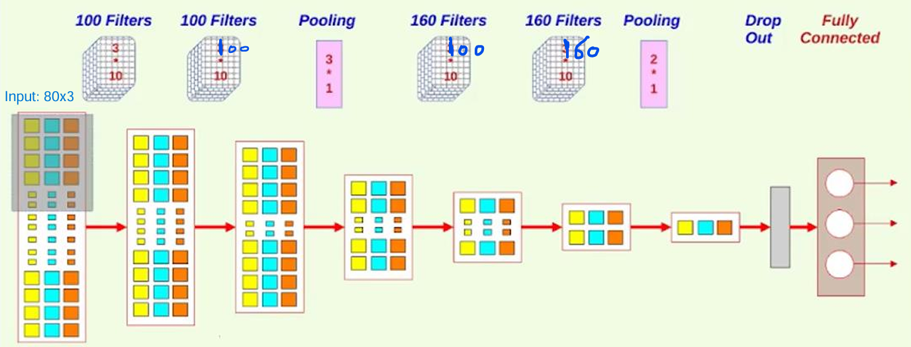
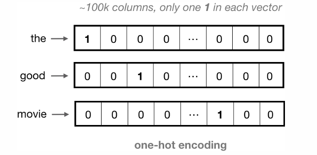
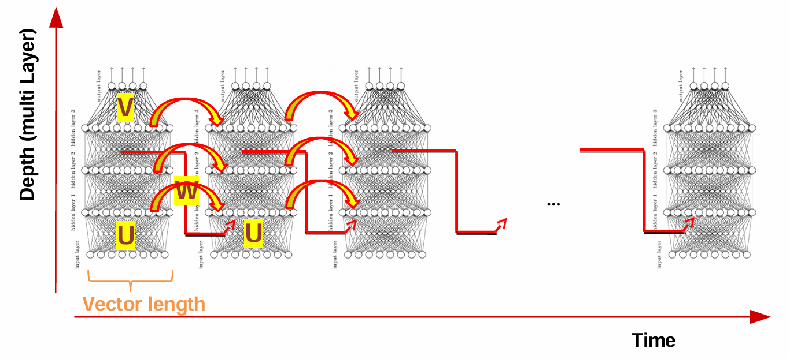
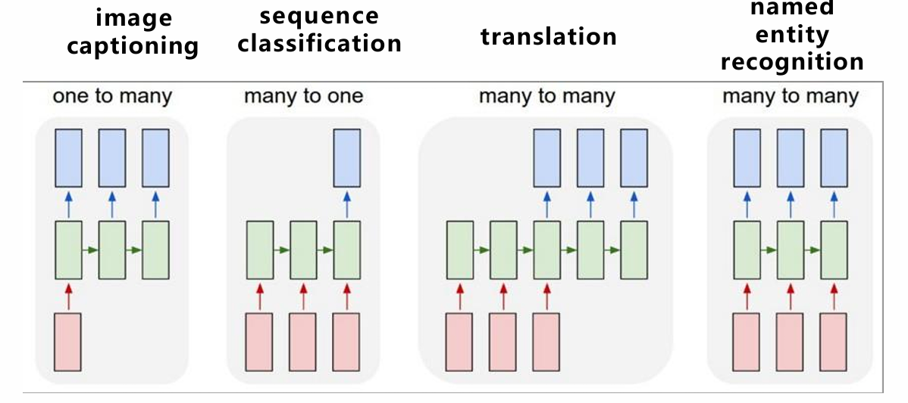
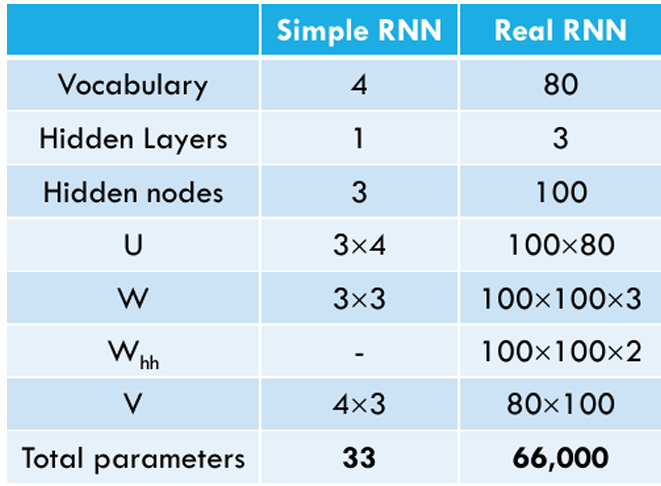
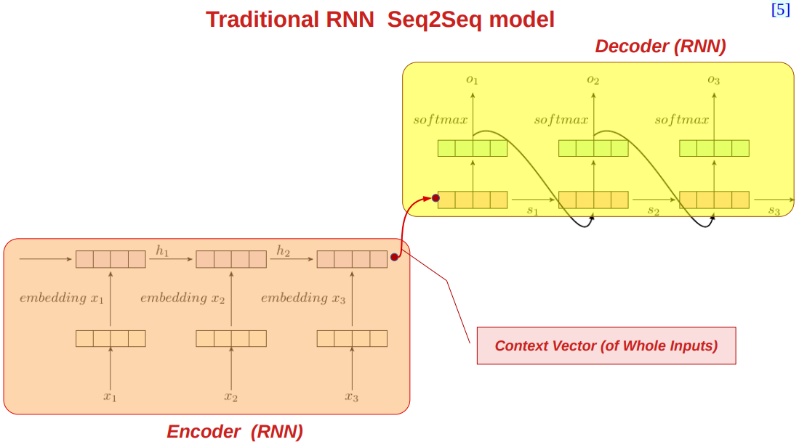
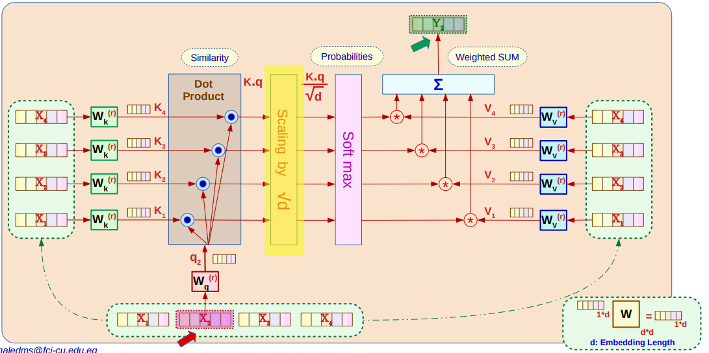
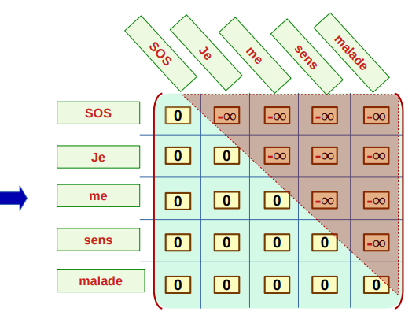

# NLP Questions

## Preprocessing

<details><summary><h3>Q1. What are preprocessing steps/techniques in NLP?</h3></summary>

- Remove tags
- Case normalization
- Tokenization
- Stopword removal
- Stemming
- Lemmatization
- Punctuation removal

</details>

---

## Feature Extraction

<details><summary><h3>Q2. What are two main approaches for word embedding?</h3></summary>

- Frequency-based methods
  - One-hot encoding
  - Bag-of-words (BOW)
  - Term frequency-inverse document frequency (TF-IDF)
  - Co-occurrence matrix
- Prediction-based methods
  - Word2Vec
    - Skip-gram
    - Continuous bag of words (CBOW)
  - GloVe

</details>

<details><summary><h3>Q3. What are the steps for one-hot encoding?</h3></summary>

1. Create a vocabulary of unique words from the text.
2. Integer Encoding: Assign a unique index to each word in the vocabulary.
3. Create a binary vector for each word:
   - The length of the vector is equal to the size of the vocabulary.
   - Set the index corresponding to the word to 1, and all other indices to 0.

</details>

<details><summary><h3>Q4. What is the distance between any two vectors in one-hot and integere encoding?</h3></summary>

- The distance between any two vectors in one-hot encoding is 2 or 0.
- The distance between any two vectors in integer encoding depends on the difference in their indices.

</details>

<details><summary><h3>Q5. What is disadvantage of Bag-of-Words (BOW) model?</h3></summary>

Any information about the order or structure of the words in the document is discarded.

</details>

<details><summary><h3>Q6. What are BoW involves?</h3></summary>

- A vocabulary of known words. (AKA Vocab)
- A measure of the presence of known words in the document. (Histogram)

</details>

<details><summary><h3>Q7. What is corpus?</h3></summary>

A collection of selected documents.

</details>

<details><summary><h3>Q8. What are the steps to represent documents using BoW?</h3></summary>

1. Prepare a corpus of documents.
2. Tokenize the documents into words.
3. Apply "Stemming" or "Lemmatization" to the words.
4. Create a vocabulary of unique words from the corpus.
5. Omit stop words from the vocabulary.
6. Create a histogram for each document, counting the occurrences of each word in the vocabulary.

</details>

<details><summary><h3>Q9. What is a potential problem with using BoW?</h3></summary>

For documents not considered during vocab desing, they may contain some words not in the vocabular (out-of-vocabulary words). **Those words are ignored**.

</details>

<details><summary><h3>Q10. Why not using Words Frequencies? (Distadvantages of BoW)</h3></summary>

- Word Counts are very basic.
- Stop words (e.g., "the", "is", "and") may appear many times in the documents. Their **large counts** means **LOW discrimination** power between documents.

</details>

<details><summary><h3>Q11. What is TF-IDF Tries to do?</h3></summary>

Tries to highlight words that are more interesting:
Terms that are (1) Frequent in a document and (2) Less frequent  across documents

</details>

<details><summary><h3>Q12.What is the difference between CBOW and Skip-gram in Word2Vec?</h3></summary>

- CBOW:
  - predicts the target word from the context words.
  - Used when you have a lot of data.
  - Order of words in the context is not important
  - Faster to train.
  - Good for frequent words.
  - Architecture:
  
- Skip-gram:
  - predicts the context words from the target word.
  - Used when you have less data.
  - Slower to train.
  - Good for infrequent words.
  - Architecture:
  

</details>

<details><summary><h3>Q13.What is Window Size in Word2Vec?</h3></summary>

- Window Size:
  - The number of words to consider on either side of the target word.
  - Number of context words to consider = 2 * window size.

</details>

<details><summary><h3>Q14.what is the goal of Word2Vec?</h3></summary>

- The goal of Word2Vec is to learn vector representations of words such that words with similar meanings are close together in the vector space.

- Not to predict the next word in a sentence.

</details>

<details><summary><h3>Q15.What is Negative Sampling in Word2Vec?</h3></summary>

- Negative Sampling:
  - Words that are not in the context of the target word are treated as negative samples.
  - A technique used to train Word2Vec models more efficiently.
  - it converts the multi-class classification problem into a binary classification problem.
  - it uses sigmoid instead of softmax.
  - for each target word, K negative samples are randomly selected from the vocabulary.
- Architecture:
  

</details>

<details><summary><h3>Q16.How many pairs of training data are generated if the window size is 2 and the sentence is "I love natural language processing" negative samples=3?</h3></summary>

- For the sentence "I love natural language processing" with a window size of 2, the pairs of training data generated would be:
  - (I, love), (I, natural)   we have 6 negative samples  all = 6 + 2 = 8 pairs of training data.
  - (love, I), (love, natural), (love, language)  we have 9 negative samples  all = 9 + 3 = 12 pairs of training data.
  - (natural, I), (natural, love), (natural, language), (natural, processing) we have 12 negative samples  all = 12 + 4 = 16 pairs of training data.
  - (language, love), (language, natural), (language, processing)  we have 9 negative samples  all = 9 + 3 = 12 pairs of training data.
  - (processing, natural), (processing, language) we have 6 negative samples   all = 6 + 2 = 8 pairs of training data.
  - Total pairs = 8 + 12 + 16 + 12 + 8 = 56 pairs of training data.

</details>

<details><summary><h3>Q17. What are the Training steps for a Negative Sampling mode?</h3></summary>

Training steps for a Negative Sampling model:

1. **Input:**
   - One input target word + one positive/negative word (one-hot encoded).

2. **Label Assignment:**
   - Positive sample → **Y = 1**
   - Negative sample → **Y = 0**

3. **Embedding:**
   - Pass both words through **separate embedding layers** (output: dense vectors of size `embed_size`).

4. **Similarity Calculation:**
   - Compute **dot product** of the two embeddings.

5. **Activation:**
   - Apply **sigmoid** to dot product → outputs a value between 0 and 1.

6. **Loss and Backpropagation:**
   - Compare sigmoid output to actual label Y.
   - Compute loss and **backpropagate** error to update weights.

7. **Repeat:**
   - Perform the above steps for all (target, context) pairs across multiple epochs.

</details>

<details><summary><h3>Q18. What is a limitation of One-Hot Encoding regarding word relationships?</h3></summary>

A limitation of One-Hot Encoding is that the distance between the one-hot encoded vectors of any two different words is the same. This means it does not capture any semantic similarity or relationship between words, only their distinct identity.

</details>

<details><summary><h3>Q19. Derive Cost Function for Skip-Gram Model</h3></summary>

- The network predicts the probability of a context word given a target word:  

```math
P(w_\text{context}|w_\text{center};\theta)=\frac{e^{W_{\text{output}_{(c)}} \cdot h}}{\sum_{i=1}^{V} e^{W_{\text{output}_{i}} \cdot h}}
```  

- Objective is to maximize the log-likelihood of the context words given the target word:

```math
J(\theta) = arg\max_\theta \log \prod_{w_\text{context} \in C(w_\text{center})} P(w_\text{context}|w_\text{center};\theta)=arg\max_\theta \log \prod_{c=1}^{C} \frac{e^{W_{\text{output}_{(c)}} \cdot h}}{\sum_{i=1}^{V} e^{W_{\text{output}_{i}} \cdot h}}
```  

- Converting objective to a loss function:  

```math
  L(\theta; w^{(t)}) = - \log \prod_{c=1}^{C} \frac{e^{W_{\text{output}_{(c)}} \cdot h}}{\sum_{i=1}^{V} e^{W_{\text{output}_{i}} \cdot h}} = -\sum_{c=1}^{C} \log \frac{e^{W_{\text{output}_{(c)}} \cdot h}}{\sum_{i=1}^{V} e^{W_{\text{output}_{i}} \cdot h}}
```

```math
  L(\theta; w^{(t)}) = - \sum \log P(w_\text{context}|w_\text{center};\theta)
```

</details>


<details><summary><h3>Q20. What is the problems with Skip-Gram?</h3></summary>

Softmax is applied to the values of the output layer, which can be computationally very expensive for large vocabularies.

</details>

<details><summary><h3>Q21. Why using sigmoid instead of softmax in Negative Sampling?</h3></summary>

Negative sampling converts multi-classification task into binary-classification task.
The new objective is to predict, for any given word-context pair (w,c), whether the word (c) 
is in the context window of the the center word (w) or not.

</details>

<details><summary><h3>Q22. How to Get “Embeddings” from Negative Sampling Model?</h3></summary>

To get word embeddings for entire vocabulary:
Extract the embeddings from  word_model embedding layer.
(use Target wordEmbedding NOT Context wordembedding)

</details>

<details><summary><h3>Q23. What are the limitations of Word2Vec?</h3></summary>

- Out-of-vocabulary (OOV) words: Words not seen during training are ignored.
- Morpohological variations: Different forms of a word (e.g., "run", "running") are treated as distinct words.

</details>

<details><summary><h3>Q24. What is the FastText Objective?</h3></summary>

Utilizing the internal structure of words to make the process of learning word embeddings more efficient.

</details>

<details><summary><h3>Q25. What is the main difference between Word2Vec and FastText?</h3></summary>

- Word2Vec representation is word-based
- FastText representation is character n-gram based.

</details>

<details><summary><h3>Q26. What is the main advantage of FastText over Word2Vec?</h3></summary>

In FastText, Representing out-of-vocab words by summing their sub-words has performance than assigning null vectors like Word2Vec.  

FastText generally has better performance than Baseline Word2Vec algorithms (CBOW and SkipGram) even with OOV.

</details>

<details><summary><h3>Q27. What are the steps for Skip-Gram Representation Of FastText Embedding?</h3></summary>

1. **Select Target and Context Words**
   - Using a sliding window of size 2C+1, where C is the context size.
2. **Select Negative Samples for each context word**
   - For one actual context word, “N” random negative words are sampled  (e.g. N=5)
3. **Sub-word generation**
   - By creating character n-grams (length 3–6) from words enclosed in angle brackets.
4. **Prepare Vectors for Target, Context, and Negative Words**
   - Target word vector: Sum of vectors of all sub-words.
5. **Train Neural Network with:** two inputs, one hidden layer and one segmoid output
   - By maximizing similarity with context words and minimizing similarity with negative samples using a neural network.
   - Architecture:
   - 

</details>

<details><summary><h3>Q28. What is the goal of stemming and lemmatization and what is the difference between them?</h3></summary>

- **Goal**: Reduce words to a common base form.

- **Stemming**: is the process that stems or removes last few characters from a word, often leading to incorrect meanings and spelling.
  - For example, Caring becomes Car, and Cars becomes Car.
  - Used in case of large datasets where performance is an issue.
- **Lemmatization**: considers the context and converts the word to its meaningful base form.
  - For example, Caring becomes Care, and Cars becomes Car.
  - Used in case of small datasets where accuracy is an issue, because its computationally expensive.

</details>

---

## Classification

<details><summary><h3>Q1. What are two types of time-idexed data?</h3></summary>

- **Equally spaced**: Data points are collected at regular intervals (e.g., daily, monthly).
- **Ordinal time steps**: Data points are collected at irregular intervals, but the order of events is preserved (e.g., word sequences).

</details>

<details><summary><h3>Q2. Given the following architecture, what is the output shape and number of parameters of each layer?</h3>

- **Architecture**:
  - 

</summary>

- **Answer**:
  - 

</details>

<details><summary><h3>Q3. What is the difference between 1D, 2D, and 3D convolution?</h3></summary>

- 1D CNN,
  - kernel moves in 1 direction.
  - Input and output data of ID CNN is 2 dimensional.
  - Mostly used on Time-Series data.
- 2D CNN,
  - kernel moves in 2 directions.
  - Input and output data of 2D CNN is 3 dimensional.
  - Mostly used on Image data
- 3D CNN,
  - kernel moves in 3 directions.
  - Input and output data of 3D CNN is 4 dimensional.
  - Mostly used on 3D Image data (MRI, CT Scans).

</details>

<details><summary><h3>Q4. What are the steps to apply 1D CNN for text classification?</h3></summary>

1. **Word Tokenization**:
   - Represented in a dictionary that maps each unique word to their token, {'the': 0, 'of': 1, 'so': 2, 'then': 3, 'you': 4, … }
   - Vocab: all unique words in the text.
   - Token: a unique integer assigned to each word in the vocab.
2. **Word One-Hot Encoding**:
   - 
3. **Word Embedding**:
   - 
4. **Convolutional Kernel**:
   - 

</details>

<details><summary><h3>Q5. Why using Max-Pooling over Time?</h3></summary>

In order to indicate the presence of these high-level features, we need a way to identify them in a vector, regardless of the location within the larger input sequence. One way to identify important features, no matter their location in a sequence, is to discard less-relevant, locational information.


</details>

<details><summary><h3>Q6. Draw the architecture for using multiple kernels with different scales in 1D CNN (Input Shape 7x5, output is 2 classes).</h3></summary>


</details>

<details><summary><h3>Q7. What are the Traditional Language Models?</h3></summary>

A language model computes a probability for a sequence of words: $P(w_1, ..., w_T)$  

Example: Zein is playing football  

$P(\text{Zein is playing football}) = P(w_1, w_2, w_3, w_4)$

$P(\text{Zein is playing football}) = P(w_1) * P(w_2|w_1) * P(w_3|w_1, w_2) * P(w_4|w_1, w_2, w_3)$

$P(\text{Zein is playing football}) = P(\text{Zein}) * P(\text{is}|\text{Zein}) * P(\text{playing}|\text{Zein}, \text{is}) * P(\text{football}|\text{Zein}, \text{is}, \text{playing})$

$P(w_2|w_1) = \frac{\text{count}(w_1, w_2)}{\text{count}(w_1)}$

</details>

<details><summary><h3>Q8. Draw RNN architecture (Folded and Unfolded)</h3></summary>


</details>

<details><summary><h3>Q9. Draw Unfolded RNN architecture with multiple hidden layers</h3></summary>



</details>

<details><summary><h3>Q10. Give 4 examples of RNN/LSTM applications specifying the type of the task and draw the architecture for each.</h3></summary>



</details>

<details><summary><h3>Q11. Draw the **Generation** Model Architecture for RNN</h3></summary>


</details>

<details><summary><h3>Q12. Complete the following table</h3>


</summary>

**Answer**:


</details>

<details><summary><h3>Q13. For the following RNN architecture, Derive the Backpropagation equations (BPTT), hidden activation is `tanh` output activation is `softmax`</h3>


</summary>

**Answer**:

**Forawrd Calculation:**

```math
\displaylines{s_t = \tanh{(W s_{t-1} + U x_t)}\\
\hat{y}_t = \text{softmax}(o_t) = \text{softmax}(V s_t)\\
o_t = V s_t}
```

**Loss and Cost Function:**

```math
\displaylines{E_t(y_t,\hat{y}_t) = -y_t \log(\hat{y}_t)\\
E(y, \hat{y}) = \sum_{t=1}^{T} E_t(y_t,\hat{y}_t)}
```

**Gradients:**

```math
\frac{\partial E}{\partial V} = \sum_{t=1}^{T} \frac{\partial E_t}{\partial V},\space
\frac{\partial E}{\partial U} = \sum_{t=1}^{T} \frac{\partial E_t}{\partial U}, \space
\frac{\partial E}{\partial W} = \sum_{t=1}^{T} \frac{\partial E_t}{\partial W}
```

**Gradients by Chain Rule:**

```math
\displaylines{\frac{\partial E_t}{\partial V} = \frac{\partial E_t}{\partial \hat{y}_t} \cdot \frac{\partial \hat{y}_t}{\partial o_t} \cdot \frac{\partial o_t}{\partial V}\ (1)\\

\frac{\partial E_t}{\partial U} = \frac{\partial E_t}{\partial \hat{y}_t} \cdot \frac{\partial \hat{y}_t}{\partial s_t} \cdot \frac{\partial s_t}{\partial U}\\

\frac{\partial s_t}{\partial U} = \sum_{t'=1}^{T} \frac{\partial s_{t}}{\partial s_t'} \cdot \frac{\partial s_t'}{\partial U}\\

\frac{\partial E_t}{\partial U} = \sum_{t'=1}^{T} \frac{\partial E_t}{\partial \hat{y}_t} \cdot \frac{\partial \hat{y}_t}{\partial s_t} \cdot \frac{\partial s_{t}}{\partial s_t'} \cdot \frac{\partial s_t'}{\partial U}\ (2)\\

\frac{\partial E_t}{\partial W} = \frac{\partial E_t}{\partial \hat{y}_t} \cdot \frac{\partial \hat{y}_t}{\partial s_t} \cdot \frac{\partial s_t}{\partial W}\\

\frac{\partial s_t}{\partial W} = \sum_{t'=1}^{T} \frac{\partial s_{t}}{\partial s_t'} \cdot \frac{\partial s_t'}{\partial W}\\

\frac{\partial E_t}{\partial W} = \sum_{t'=1}^{T} \frac{\partial E_t}{\partial \hat{y}_t} \cdot \frac{\partial \hat{y}_t}{\partial s_t} \cdot \frac{\partial s_{t}}{\partial s_t'} \cdot \frac{\partial s_t'}{\partial W}\ (3)}

```

**Backpropagation Equations:**

```math
\displaylines{\frac{\partial E}{\partial V} = \sum_{t=1}^{T} \frac{\partial E_t}{\partial V} = \sum_{t=1}^{T} \left( \frac{\partial E_t}{\partial \hat{y}_t} \cdot \frac{\partial \hat{y}_t}{\partial o_t} \cdot \frac{\partial o_t}{\partial V} \right) \\

\frac{\partial E}{\partial U} = \sum_{t=1}^{T} \frac{\partial E_t}{\partial U} = \sum_{t=1}^{T} \left( \sum_{t'=1}^{T} \frac{\partial E_t}{\partial \hat{y}_t} \cdot \frac{\partial \hat{y}_t}{\partial s_t} \cdot \frac{\partial s_{t}}{\partial s_t'} \cdot \frac{\partial s_t'}{\partial U} \right) \\

\frac{\partial E}{\partial W} = \sum_{t=1}^{T} \frac{\partial E_t}{\partial W} = \sum_{t=1}^{T} \left( \sum_{t'=1}^{T} \frac{\partial E_t}{\partial \hat{y}_t} \cdot \frac{\partial \hat{y}_t}{\partial s_t} \cdot \frac{\partial s_{t}}{\partial s_t'} \cdot \frac{\partial s_t'}{\partial W} \right)}
```

</details>

<details><summary><h3>Q14. What is the problems with RNNs?</h3></summary>

Error Gradients pass through nonlinearity every step  
Saturation at both ends ==> zero gradient  
Vanishing completely after a few time steps.  

</details>

<details><summary><h3>Q15. What is the problem with tanh activation in RNNs?</h3></summary>

- The **derivative of tanh** ranges between **0 and 1**.

- When the **tanh derivative is small**, the gradients **shrink** exponentially over time steps $\rightarrow$ this leads to the **Vanishing Gradient Problem**.

- If the gradients **grow exponentially**, it leads to the **Exploding Gradient Problem** — this is **not** due to the tanh function itself, but rather due to how gradients accumulate through time.

</details>

<details><summary><h3>Q16. Draw RNN Unit Architecture</h3></summary>


</details>

<details><summary><h3>Q17. Draw GRU Unit Architecture</h3></summary>


</details>

<details><summary><h3>Q18. Draw LSTM Unit Architecture</h3></summary>


</details>

<details><summary><h3>Q19. What are the gates in GRU and what are their functions/effects?</h3></summary>

- **Update Gate**: Controls how much of the past information to keep and how much to update with new information.
  - If $G_u=0$, Keep Memory Value "$C_{t}$" Same as the previous Value "$C_{t-1}$".
  - If $G_u=1$, Forget Previous Memory Value "$C_{t-1}$".

- **Relevance Gate**: Controls how much of the new information to add to the memory.
  - If $G_r=1$, $C_{t-1}$ is Relevant to update Candidate Memory Value "$\tilde{C}$".
  - If $G_r=0$, $C_{t-1}$ is Not Relevant to update Candidate Memory Value "$\tilde{C}$".

- If $G_u=1$ and $G_r=0$, Traditional NN (No Recurrency).
- If $G_u=1$ and $G_r=1$, RNN (Not GRU).
- If $G_u= 0 \rightarrow 1$ and $G_r= 0 \rightarrow 1$, GRU (General Case).

</details>

<details><summary><h3>Q20. In LSTM, Why we removed relevance gate?</h3></summary>

$W_{cc}$ can Do the same functionality It can Control the amount of relevance of $C_{t-1}$

</details>

<details><summary><h3>Q21. What are the gates in LSTM and what are their functions/effects?</h3></summary>

- **Forget Gate**: Decides what portion of the previous memory $C_{t-1}$ to forget.
  - If $G_f=0$, Forget Previous Memory Value " $C_{t-1}$ ".
  - If $G_f=1$, Keep Memory Value " $C_{t}$ " Same as the previous Value " $C_{t-1}$ ".
- **Update Gate**: Controls how much of the new candidate information $\tilde{C}$ to add to the memory.
  - If $G_i=0$, Do Not Update Memory Value " $C_{t}$ ".
  - If $G_i=1$, Update Memory Value " $C_{t}$ " with Candidate Memory Value " $\tilde{C}$ ".
- **Output Gate**: Controls how much of the cell state $C_t$ should be used for the output.
  - If $G_o=0$, Do Not Output Memory Value " $C_{t}$ ".
  - If $G_o=1$, Output Memory Value " $C_{t}$ ".

</details>

---

## Transformers

<details><summary><h3>Q1. Draw Traditional RNN Seq2Seq Architecture</h3></summary>



</details>

<details><summary><h3>Q2. What are the challenges with Traditional RNN Seq2Seq?</h3></summary>

1. **Bottleneck**: The meaning of the entire input sequence is Expected to be captured by a single context vector with fixed dimensionality

2. **Sequential Processing**: Can NOT do processing in Parallel

3. **Very Long Sequence**: Vanishing Gradient

</details>

<details><summary><h3>Q3. Explain how to overcome the Bottlneck challenge in Traditional RNN Seq2Seq?</h3></summary>

- **Attention Mechanism**: Instead of using a single context vector, use a weighted sum of the hidden states.
- **Decoder Utilizes**:
  - Context Vector
  - Weighted sum of hidden states

</details>

<details><summary><h3>Q4. Illustrate the Attention Mechanism in Seq2Seq and mention what this mechanism supports?</h3></summary>


- **Supports**:
  - Parallelization of Encoder
  - Parallelization of Decoder (Training Mode Only)
  - Very Long Sequence length

</details>

<details><summary><h3>Q5. Draw the Encoder Decoder Transformer Architecture</h3></summary>


</details>

<details><summary><h3>Q6. Draw the Multi-Head Self Attention Architecture</h3></summary>


</details>

<details><summary><h3>Q7. Illustrate How Self Attention Mechanism works in Transformer (Scaled Dot-Product).</h3></summary>



</details>

<details><summary><h3>Q8. Why we need to apply scaling in Self Attention Mechanism?</h3></summary>

- As Dimension of Embedding “d” Increases the Calculated weight value “w” increases.  
- High Weight Values kill the gradient, and slow down learning.  
- To avoid this, we scale the weight value before applying softmax by dividing it by $\sqrt{d}$. (*d is the dimension of the embedding*)

</details>

<details><summary><h3>Q9. Compare between Wide architecture and Narrow architecture in Multi-Head Self Attention</h3></summary>

- **Wide Architecture**:
  - Combines multiple heads with different sets of parameters.
  - For inupt x, each head learns a different representation y (same dimension as x).
  - All outputs are concatenated (size will be d*H where d is embedding dim and H is the number of heads) and pass through a linear transformation to reduce the dimension back to the embedding size.
  - More expressive power.
  - More parameters to train.
  - Architecture:
  

- **Narrow Architecture**:
  - Combines multiple heads.
  - Input x is split into H parts, each part is processed by a different head (input dimension is d/H for each head).
  - All outputs are concatenated (size will be d) to back to the embedding size.
  - Less expressive power.
  - Fewer parameters to train.
  - Architecture:
  

</details>

<details><summary><h3>Q10. Fill in the green gabs.</h3>


</summary>

**Answer**:


</details>

<details><summary><h3>Q11. Why we need position information in Transformer and what are the two ways to add it meantion the poblems assocciated with each?</h3></summary>

- Why: Because of parallelization, the model does not have any information about the order of the words in the sequence.

- Two ways to add position information:
  1. **Position Encoding**:
     - Function to map the positions to real valued vectors
     - Suggested Positional Encoders:
       - Use Word Index as Position Encoding
         - Problems:
           - If N is large (e.g. seq. Length = 1024), Large position Values will dominate when Combine Position Embedding to Word Embedding
           - If System is trained with Max seq length =256 how can the system deal with Larger sequence values
           - Position Encoding is scalar and Word embedding is vector (how to Combine them ?)

       - Normalize Seq. Length to “1”: Use $\delta=\frac{1}{\text{Seq. Length}}$
         - Problems:
           - $\delta$ Value depends on Seq. Length
           - Position Encoding is scalar and Word embedding is vector (how to Combine them ?)

       - Sine/Cosine Encoders:
         - Word Embedding Dimension “d” [Even Num]
         - Position Encoding Dimension “d”
         - Number of Vector Pairs “K”=d/2 [0, 1, 2,… d/2-1]
         - Elements Index “i” [0, 1, 2, …. d-1]
         - Even Index “i” is Sine Term = $\sin{(\omega_k t)}$, i=2*k
         - Odd Index “i” is Cosine Term = $\cos{(\omega_k t)}$, i=2*k+1
         - $\omega_k = \frac{1}{N^{\frac{2k}{d}}} $, N is the Seq. Length.

  2. **Position Embedding**: Use a separate embedding layer to learn position vectors.
     - Real valued vectors representing positions(Vector for each position)
     - Problem: Positions > N-1 can NOT be Embedded (Must Train Embedding on Max Expected Seq. Length)
     - Vector Length = Word Embedding length

</details>

<details><summary><h3>Q12. What are Rules Controlling Good Positional Encoder?</h3></summary>

1. $\delta=\frac{1}{\text{Seq. Length}}$ value should be small for long sequences and large for short sequences.
2. Range of position encoded values should NOT depend on the sequence length.
3. Position encoding should be VECTOR, not SCALAR.

</details>

<details><summary><h3>Q13. Why we need Residual Connection in Transformer?</h3></summary>

- Residual Connection helps to avoid the vanishing gradient problem by allowing gradients to flow through the network without being diminished.
- It also allows the model to skip the multi-head attention and feed-forward layers if they are not needed, which can help in training deeper networks.

</details>

<details><summary><h3>Q14. Why we need to use Normalization in Transformer?</h3></summary>

- **Problem**: Input distribution of each layer changes with each step (Covariate Shift).
- **Normalization**: Transforming the inputs to be Zero mean and unit variance.
- **Normalization allows each layer to**:
  - learn on a more stable distribution of inputs,
  - Accelerate the training of the network (don’t stick with very small learning rates).

> Normalization allows the network to learn parameters $\gamma$ and $\beta$ that can convert the mean and variance to any value that minimizes the loss.

</details>

<details><summary><h3>Q15. Where the normalization is appllied, What are the different types of normalization?</h3></summary>

- Normalization of weigths:
  - Weight Normalization
- Normalization of Activations:
  - **Batch Normalization**
    - Calculate (then Normalize) $\mu,\space \sigma$ for ALL Samples in the batch for each channel
    - Mini Batch Size should be large enough to minimize “batching” effect.
  - **Instance Normalization**
    - Calculate (then Normalize) $\mu,\space \sigma$ for ONE Channels in ONE Sample (Output of ONE Filter)
  - **Group Normalization**
    - Calculate (then Normalize) $\mu,\space \sigma$ for Groups of Channels in ONE Sample
  - **Layer Normalization**
    - Calculate (then Normalize) $\mu,\space \sigma$ for ALL Channels in the Same Sample (Input to Same Layer)
    - <u>Applied in Transformer</u>

</details>

<details><summary><h3>Q16. What is Masked Multi-head Self Attention Block and how it works Explain and Illustrate?</h3></summary>

- **Masked Multi-head Self Attention Block**: A block that prevents the model from attending to future tokens in the sequence during training.

Mask Values are ADDED to Masked (Scaled) Values

- Addition of “0” does not change the original values, consequently no effect on Softmax output
- Addition of “-inf” gets “Zero” output of Softmax, leaving zero attention scores for future Words.

  
  

</details>

<details><summary><h3>Q17. How can we use Decode for text generation (Illustrate)?</h3></summary>

- **Decoder for Text Generation**:
  - Get the last decoder block output
  - apply a liner layer to get a vector with the same size as the vocab size
  - apply softmax to get the probabilities of each word in the vocab

- **Illustration**:  
  

</details>

<details><summary><h3>Q18. How can we use the Encoder for text classification (Illustrate)?</h3></summary>

- **Encoder for Text Classification**:
  - Get the last encoder block output
  - Apply Average Pooling to get a single vector representation of the whole sequence
  - Apply Softmax to get the probabilities of each class

- **Illustration**:  


</details>
